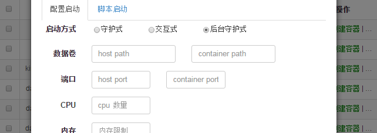
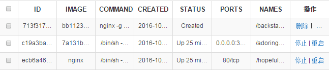

# this a simple docker dashboard

##env
###### python 2.7; django 1.8.0 ; sqlite3 ;docker remote api 1.9 ;docker 11.0

##run
```
python manage.py runserver

```
##docker主机配置

##docker镜像

##docker容器

